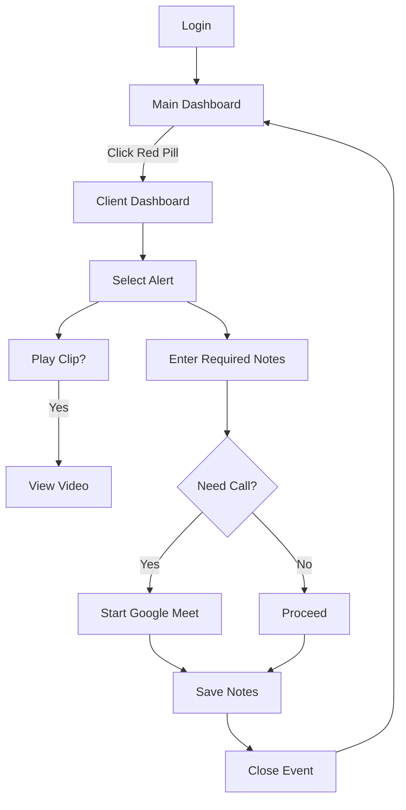
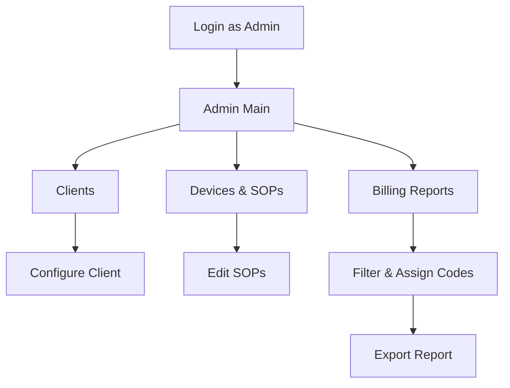

# VPS Dashboard README for Staff & Admin

This document outlines the **user-facing features** and **workflows** of the cloud-hosted Dashboard used by **Staff** and **Admin** teams to monitor, respond, and report on client-home events.

---

## Overview

The VPS Dashboard provides a **real-time, unified interface** for:

* **Staff** to see AI-verified and sensor-triggered alerts, play back event clips, log actions, and initiate two-way calls.
* **Admin** to configure clients, devices, SOPs, and generate billing-compliant reports.

Key goals:

* **Simplicity**: Minimal, intuitive UI so staff can focus on client care without distractions.
* **Accountability**: Mandatory logging of every action to support compliance and billing.
* **Flexibility**: Configurable modules (clients, devices, SOPs, reports) for easy expansion.

---

## Staff Dashboard

### 1. Login Screen

* Email & Password fields
* Remember Me checkbox

### 2. Main Dashboard

* **Top Bar**: App name, user avatar, notification bell with badge
* **Client Grid**: One card per client showing:

  * Client name & last-check timestamp
  * Status pill:

    * **Green**: no active alerts
    * **Red**: new AI-verified alert
    * **Yellow**: in-progress alert
* **My Queue Toggle**: Filter to show only your assigned or new alerts
* **Real-Time Notifications**: Toasts and push notifications for new events
* **Stations Panel** (slide-out): List of logged-in stations and their status (Active/Idle/Offline)

### 3. Client Dashboard

* **Header**: Back button, client name, status pill, Emergency Services contact
* **Active Alerts Panel**: List of AI-verified events:

  * Event type icon, timestamp, “Play Clip ▶” link if video
* **Event Action Section** (for selected alert):

  1. **Notes** textarea (required)
  2. **Buttons**:

     * **Start Call** (Google Meet)
     * **Save Notes** (activates Close)
     * **Close Event** (resolve alert)
* **Tabs**:

  * **Overview**: address, ISP schedule, device list
  * **History**: past events & notes
  * **SOP Library**: procedures list with relevant SOP highlighted

### 4. Staff Workflows

---

## Admin Dashboard

### 1. Login Screen

* Identical to Staff, routes to Admin UI

### 2. Admin Main View

* **Top Bar & Sidebar Navigation**:

  * **Clients**, **Devices & SOPs**, **Schedules**, **Billing Reports**, **Global Settings**, **Users & Stations**

### 3. Clients Module

* **List**: Name, Status, Last Check, Actions (Edit/Delete)
* **Detail Form**:

  * Basic Info (name, address, timezone, emergency contact)
  * ISP Schedule editor

### 4. Devices & SOPs Module

* **Device Inventory**: Add/edit cameras & sensors (type, label, priority)
* **SOP Editor**: Create/update action lists per event type

### 5. Billing Reports Module

* **Filter Panel**: Date range, client, staff
* **Results Table**:

  * Date/Time | Client | Staff | Event | Notes | Billing Code (editable)
* **Actions**: Bulk assign codes, Export CSV/PDF

### 6. Global Settings Module

* Idle-check toggle & timeout
* Retention periods
* Notification templates

### 7. Users & Stations Module

* Manage staff accounts & roles
* View/force-logout stations

### 8. Admin Workflows

---

## Next Steps for Development

1. **Wireframe Implementation**: Build above screens in Next.js PWA.
2. **API Integration**: Connect login, webhooks, events, and reports endpoints.
3. **Real-Time**: Add WebSocket & Web Push subscriptions.
4. **Google Meet**: Implement “Start Call” button logic.
5. **Testing**: Use the client-side sandbox to simulate alerts.

---

This README focuses solely on the **user-facing dashboards** and their workflows—perfect for jumping straight into UI design and development.
